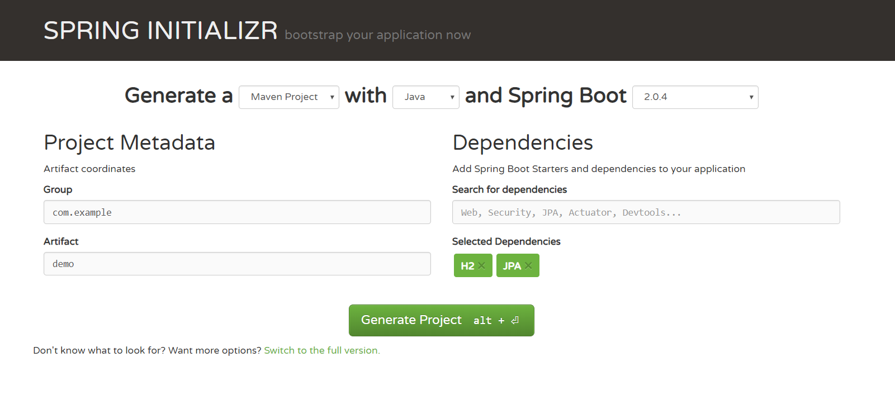
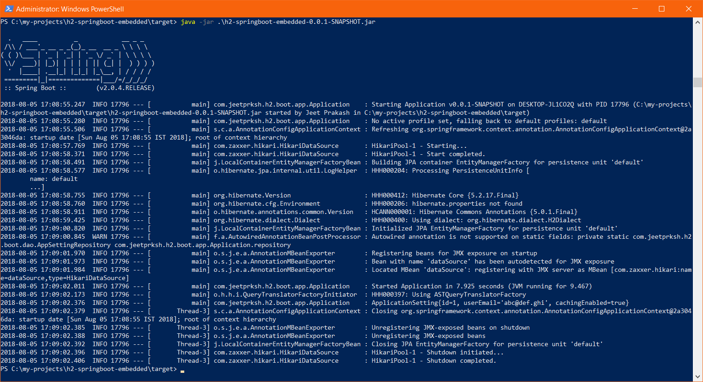

It’s a well known fact that when we are building a web application it is nearly impossible to do away with some form of data storage. There's got to be a database, relational or non-relational, where we need to store the business data to be retrieved and used later. Desktop applications too might require some useful data to be be stored locally like application settings, cached data from servers etc.

H2 is one of the lightweight and open source relational database management system written in java and can be easily embedded in java applications or run in client server mode. In this post we are going to use H2 database embedded in a Spring Boot application. And for the sake simplicity we will only creating a dummy application setting record on out embedded H2 database and then retrieving the same record. So let’s begin!

## Setting up Spring Boot project

Setting up a Spring Boot project is quite easy. Head to [Spring Initializr](https://start.spring.io/) website and fill in the appropriate details on left under "Project Metadata". Under "Dependencies" fill in H2 and JPA as dependencies and hit "Generate Project". This will download a preconfigured spring boot project that we can open with our favourite IDE.



Once we have our initial project setup with IDE, we can start adding more details on it.

## Adding JPA Repository and Entity

Next up is adding database Entity and corresponding Spring Data JPA Repository to do CRUD operation on that repository. Since we have decided to save application settings into embedded H2 database we would need to create an entity class for Application Settings.

```java
package com.jeetprksh.h2.boot.entity;

import javax.persistence.Entity;
import javax.persistence.GeneratedValue;
import javax.persistence.GenerationType;
import javax.persistence.Id;

@Entity
public class ApplicationSetting {

    @Id
    @GeneratedValue(strategy = GenerationType.IDENTITY)
    private Integer id;
    private String userEmail;
    private boolean cachingEnabled;

    ApplicationSetting() {

    }

    public ApplicationSetting(String userEmail, boolean cachingEnabled) {
        this.userEmail = userEmail;
        this.cachingEnabled = cachingEnabled;
    }

    @Override
    public String toString() {
        return "ApplicationSetting{" +
                "id=" + id +
                ", userEmail='" + userEmail + '\'' +
                ", cachingEnabled=" + cachingEnabled +
                '}';
    }
}
```

And declare a Spring Data Repository interface.

```java
package com.jeetprksh.h2.boot.dao;

import com.jeetprksh.h2.boot.entity.ApplicationSetting;
import org.springframework.data.repository.CrudRepository;

public interface AppSettingRepository extends CrudRepository<ApplicationSetting, Integer> {
}
```

Now we need to Autowire this repository and do the saving and fetching of application settings.

```java
package com.jeetprksh.h2.boot.app;

import com.jeetprksh.h2.boot.dao.AppSettingRepository;
import com.jeetprksh.h2.boot.entity.ApplicationSetting;
import org.springframework.beans.factory.annotation.Autowired;
import org.springframework.boot.SpringApplication;
import org.springframework.boot.autoconfigure.SpringBootApplication;
import org.springframework.boot.autoconfigure.domain.EntityScan;
import org.springframework.data.jpa.repository.config.EnableJpaRepositories;

import java.util.logging.Logger;

@SpringBootApplication(scanBasePackages = "com.jeetprksh.h2.boot")
@EnableJpaRepositories("com.jeetprksh.h2.boot")
@EntityScan("com.jeetprksh.h2.boot")
public class Application {

    private static Logger logger = Logger.getLogger(Application.class.getName());

	@Autowired
	private static AppSettingRepository repository;

	public static void main(String[] args) {
		SpringApplication.run(Application.class, args);
		repository.save(new ApplicationSetting("abc@def.ghi", true));
		repository.findAll().forEach(setting -> {
            logger.info(setting.toString());
        });
	}

	@Autowired
	public void setRepository(AppSettingRepository repository) {
		Application.repository = repository;
	}
}
```

**Note:** I decided to add/retrieve the settings in the configuration file itself, but it would have been better off in an appropriate service.

## Setting Application Properties

Our application would require following properties:

```properties
# Datasource
spring.datasource.url=jdbc:h2:file:~/embedded-db
spring.datasource.username=sa
spring.datasource.password=
spring.datasource.driver-class-name=org.h2.Driver

# JPA
spring.jpa.hibernate.ddl-auto=update
```

- `Spring.datasource.url`: Here we give the connection URL to the database. Since we are using embedded H2 database which saves all of its data in local file system we will be giving in the path to the file which will be used to store data. In our case this file will be in user’s home directory.
- `Spring.datasource.username`: The user name for H2 database.
- `Spring.datasource.password`: Password for database, by default it does not have one.
- `Spring.datasource.driver-class-name`: The driver class that would be used.
- `Spring.jpa.hibernate.ddl-auto`: Setting this property to “update” will enable application to use existing database and not drop the database on each startup.

## Running the Project

There are numerous ways to run a spring boot project. Let’s do it with creating executable jar with maven, following commands would do it:

```sh
mvn package
cd .\target\
java -jar .\h2-springboot-embedded-0.0.1-SNAPSHOT.jar
```



Notice that after running this application a file will be created in user home directory with name embedded-db.mv.db which will be having our database schema and all the records we will be saving into it.

 
## Code
All the working code for this project is available on this [github](https://github.com/jeetprksh/h2-springboot-embedded) repository.

 
## Useful Links
- [H2 DBMS](https://en.wikipedia.org/wiki/H2_(DBMS))
- [http://www.h2database.com/html/main.html](http://www.h2database.com/html/main.html)
- [https://start.spring.io/](https://start.spring.io/)
