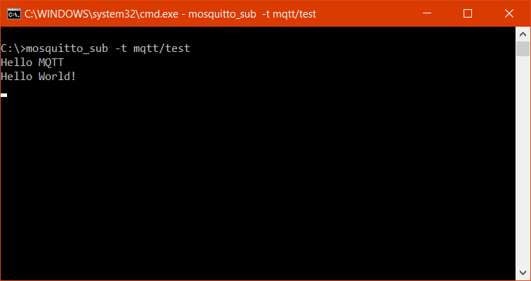
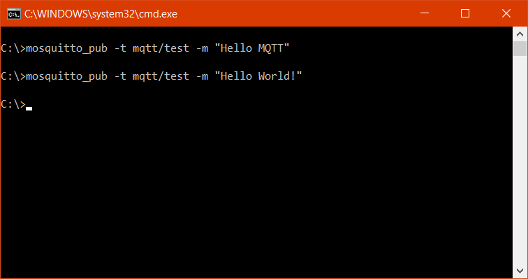

MQTT is a light-weight publish and subscribe protocol which allows low energy devices to exchange messages among each other. It is a simple messaging protocol design for resource constrained devices having low bandwidth. And hence it has found wide adoption on devices for Internet of Things (IoT) as it enables the IoT devices to receive control commands to do various things like turning the lights on or off.

There are many brokers available that implement MQTT protocol. I will be using Mosquitto Broker for the purpose of this and future posts.

## Setting up Mosquitto MQTT Broker

Head to the official [Mosquitto Downloads](https://mosquitto.org/download/) page for installing MQTT broker on your Windows or Linux machine. Or if you are more comfortable with docker you can also download and run the [official docker image](https://hub.docker.com/_/eclipse-mosquitto) from Docker Hub as well.

`docker run -it -p 1883:1883 -p 9001:9001 eclipse-mosquitto:latest`

This command will download the eclipse-mosquitto image and start the container which will listen on port 1883 for incoming connections.

## Connecting to Mosquitto MQTT Broker

Now that we have set up the Mosquitto MQTT Broker we are ready to publish messages to it. When we install the Mosquitto broker from its official downloads page it installs the CLI based MQTT client as well which allows us to publish messages and subscribe to the Mosquitto MQTT Broker.

With the following command we can subscribe to the broker:

`> mosquitto_sub -t mqtt/test`

And to publish the message to broker we can use this command:

`> mosquitto_pub -t mqtt/test -m "Hello MQTT"`

In both of the above commands we have used `-t` flag to specify which of the topics to subscribe and publish to. By default both commands will try to find the broker at localhost, if we want the clients to connect to a broker located somewhere else we can use `-h` flag for that. Also the message to be published can be specified by `-m` flag.

And as soon as we publish a message on terminal running publish client we see the same message appear on the terminal running subscriber client.

There is a lot more to MQTT that I have not covered in this post like Topic Levels, Message Encryption, Message Retention and much more. But these would surely be the topics for future posts. So stay tuned!
