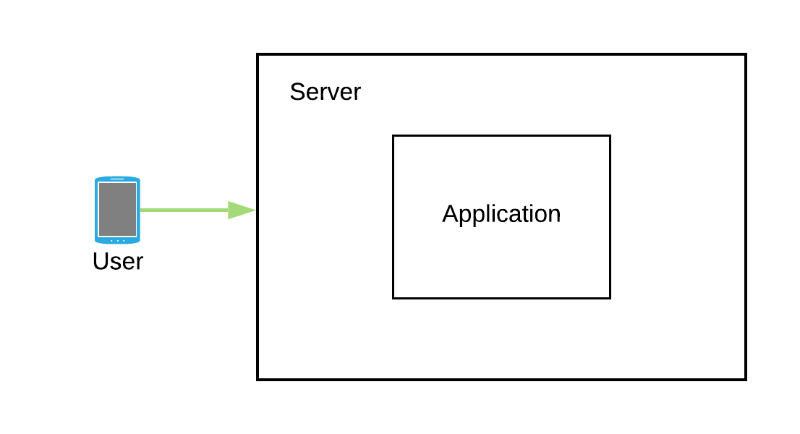
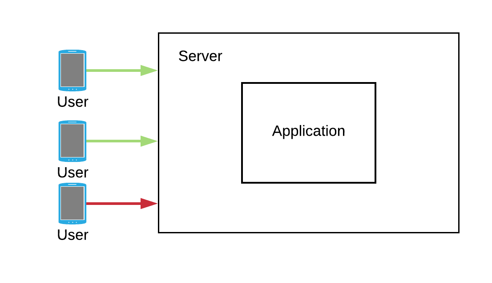
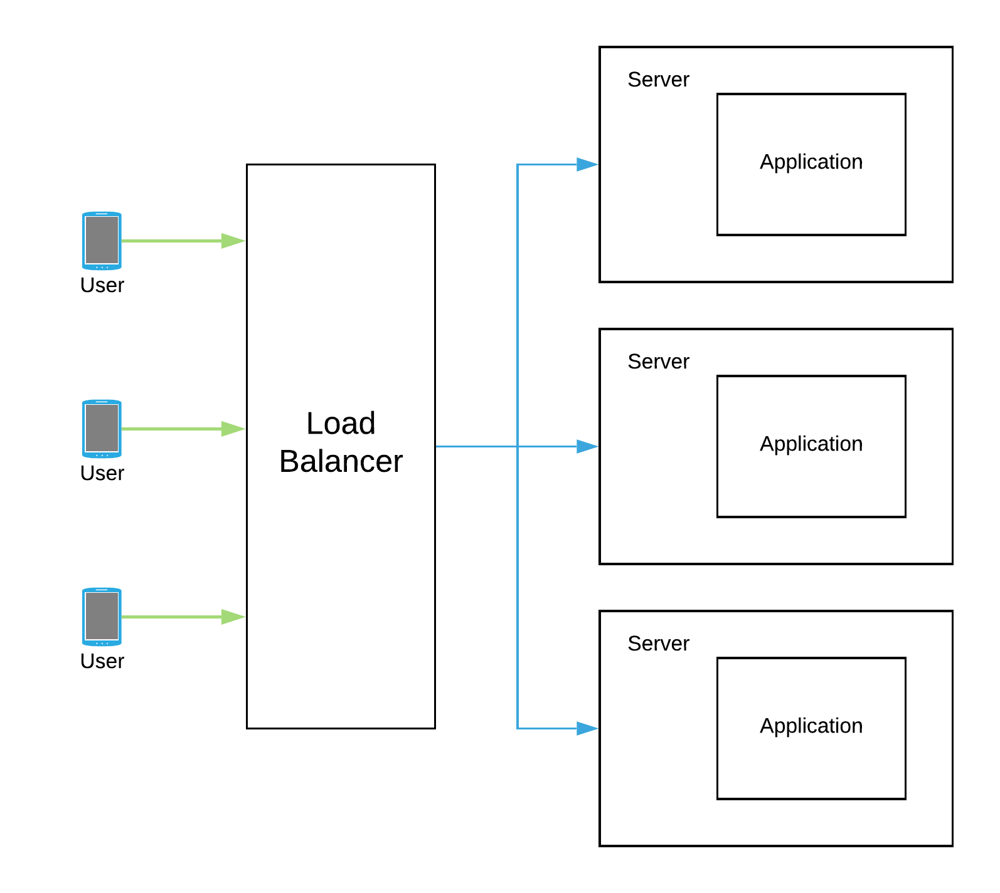

So you got this brilliant idea that you just converted into an app and deployed on one of the instances that you just bought on a cloud platform. Initially your app is not that famous and has a low user base but everything seems to be running fine with the app.

Slowly as the time goes by your app starts to get famous and your user base starts to grow with that too. So much so that during the peak hours the load becomes so high that some of the users start to experience request timeouts.

You check the resource utilization on that instance and find out that during peak time the CPU was sweating it out at 100%. So now you know the reason for those request timeouts, but what would you do to get around that? Thinking about the resource utilization, you reconfigure your instance to have more compute power and more memory. Once done, you notice that none of your users are now reporting request timeout issues they were having earlier.

A few more days went by and your users started to report the same old issue of request timeouts and slowness in the app. But you reconfigured your instance to have more compute power and you thought it was more than enough. You again check resource utilization and find out that the CPU is again working at 100% not just because a lot more users are using the app but spending more time interacting with it. So would you be adding more power to your instance? The number of users will only go up in the future and sooner the app just won’t be able to withstand the load from all of those additional users.

## Enter Scalability

Application was facing the problem because one single instance was getting stretched out of its resources. As a solution we need to scale the application so that it can withstand sudden peaks in usage. 

The simplest solution would be to add more CPU and memory to the instance so that it can use those additional resources whenever there are usage peaks, the same approach we have been trying in above example, this approach of scaling application is known as *Vertical Scaling*. While this approach will solve the problem at hand, adding more hardware to the box always comes with an upper limit. And merely praying that this upper limit never gets hit in future is certainly not the best approach!

Another solution would be to have multiple smaller instances with each instance running your application. This way we can dynamically increase the number of instances to handle sudden spikes in usage and dynamically remove them as soon as usage gets normal. This approach of scaling application is known as *Horizontal Scaling* and is more suitable for modern cloud environments as it entertains usage as per requirement.

## Horizontal Scale or Vertical Scale?

Horizontal scaling warrants using load balancer in front of the instances serving the application. And these load balancers will be responsible to distribute the load evenly among every instance of application. With a vertically scaled solution we don’t have to worry about load balancers.

The horizontal scaling solution is more resilient towards failures as we are having multiple instances of application running and other instances can handle the load in case one of them fails. On the contrary the vertical scaling solution presents a single point of failure as it is running on only a single instance.

There is no clear answer as to which one to choose. Both of these approaches come with their own pros and cons. Vertical scaling is preferable while the product is in the initial stages and the user base too is not large. But as the product gets mature and starts getting more exponential load we would need to have our application to scale horizontally.